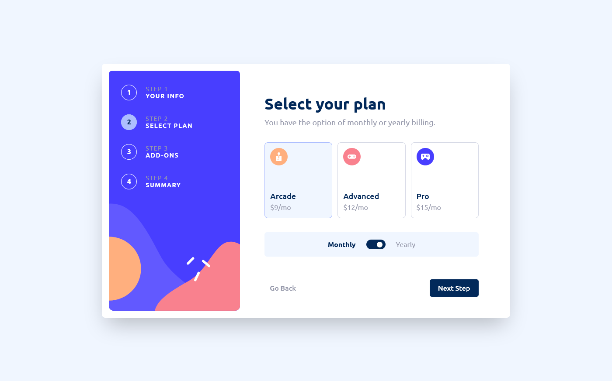

# Frontend Mentor - Multi-step form solution

This is a solution to the [Multi-step form challenge on Frontend Mentor](https://www.frontendmentor.io/challenges/multistep-form-YVAnSdqQBJ). Frontend Mentor challenges help you improve your coding skills by building realistic projects.

## Table of contents

- [Overview](#overview)
  - [The challenge](#the-challenge)
  - [Screenshot](#screenshot)
  - [Links](#links)
- [My process](#my-process)
  - [Built with](#built-with)
  - [What I learned](#what-i-learned)
- [Author](#author)

**Note: Delete this note and update the table of contents based on what sections you keep.**

## Overview

### The challenge

Users should be able to:

Challenges from creators:

- Complete each step of the sequence
- See a summary of their selections on the final step and confirm their order
- View the optimal layout for the interface depending on their device's screen size
- See hover and focus states for all interactive elements on the page

I also added several features by myself:

- I added validation to each of the fields in the form in the first step
- The last message thanking you for your purchase displays the user's nickname, phone number and email address

### Screenshot

### Links

- Live Site URL: [Add live site URL here](https://dawidbugajski.github.io/multi-step-form/)

## My process

### Built with

- [React](https://reactjs.org/) - JS library
- [Redux Toolkit Query](https://redux-toolkit.js.org/) - Redux overlay library for managing application state
- [Ant Design](https://ant.design/) - React library using for switch
- [Tailwindcss](https://tailwindcss.com/) - Tailwindcss

### What I learned

In the project I practiced I learned among other things :

- Planning and storage of the entire application state in one place with redux toolkit query
- Using multiple slices from redux
- Creating reusable components, separating logic from UI
- Creating function helpers for use in multiple locations

## Author

- Github - [DawidBugajski](https://github.com/DawidBugajski)
- Linkedin - [DawidBugajski](https://www.linkedin.com/in/dawid-bugajski-1bb01519b/)
